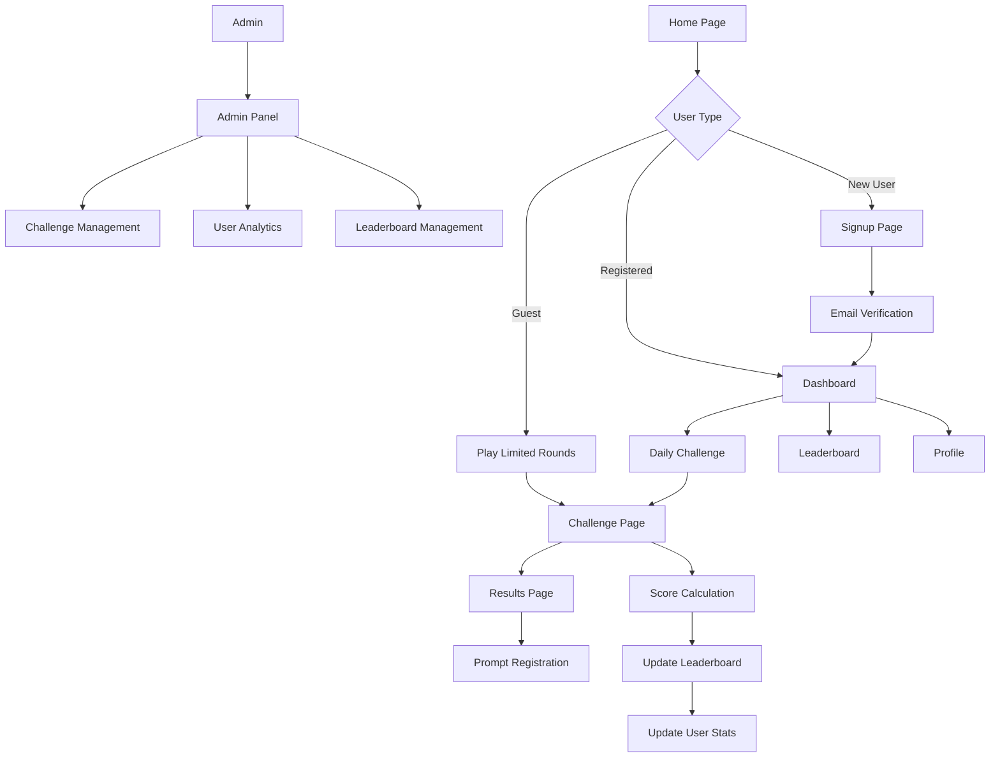

## 1. Product Overview
Guess2 is a premium-feel, single-player trivia and word challenge web application that provides asynchronous gameplay with daily/weekly challenges, leaderboards, user streaks, loyalty points, and achievement systems. The platform offers both free and premium subscription tiers to engage users in competitive trivia gaming.

Target users include trivia enthusiasts, casual gamers seeking daily mental challenges, and competitive players who enjoy leaderboard rankings and achievement hunting.

## 2. Core Features

### 2.1 User Roles
| Role | Registration Method | Core Permissions |
|------|---------------------|------------------|
| Guest | No registration required | Browse challenges, play limited rounds (3 per day), view basic leaderboards |
| Registered User | Email registration | Full challenge access, track points/streaks/achievements, unlimited daily play |
| Premium Subscriber | Stripe subscription upgrade | Access past challenges, bonus rounds, extra loyalty rewards, exclusive content |
| Admin | Manual creation via admin panel | CRUD challenges/questions, user management, analytics, leaderboard management |

### 2.2 Feature Module
Our trivia game application consists of the following main pages:
1. **Home/Landing page**: Game pitch, features showcase, CTA to play or sign up
2. **Auth pages**: Signup/login, password reset functionality
3. **Dashboard**: Daily challenge display, streaks tracker, points summary, achievements showcase, past attempts history
4. **Challenge page**: Timed solo gameplay (MCQ or word puzzles), real-time scoring, result submission
5. **Leaderboard page**: Daily/weekly/all-time rankings with fast Redis-powered updates
6. **Profile page**: User statistics, achievements collection, subscription status management
7. **Admin panel**: Challenge/question CRUD operations, user management system, analytics dashboard

### 2.3 Page Details
| Page Name | Module Name | Feature description |
|-----------|-------------|---------------------|
| Home/Landing | Hero section | Display game title, key features, and compelling CTA buttons for immediate gameplay or signup |
| Home/Landing | Features showcase | Highlight daily challenges, leaderboards, achievements, and premium benefits |
| Auth | Signup form | Collect email, password, username; validate inputs; create user account via Supabase |
| Auth | Login form | Authenticate users with email/password; handle password reset requests |
| Dashboard | Daily challenge card | Show today's challenge with difficulty level, estimated time, and start button |
| Dashboard | Streak tracker | Display current streak count, last played date, streak milestone rewards |
| Dashboard | Points summary | Show total loyalty points, recent earnings, redemption options |
| Challenge | Question display | Present multiple-choice or word puzzle questions with timer countdown |
| Challenge | Answer submission | Capture user answers, calculate speed bonus, track answer streaks |
| Challenge | Real-time scoring | Update score with correct answers (+10), speed bonus (+5), streak multiplier (1.1x) |
| Leaderboard | Ranking display | Show top 100 players with scores, rank changes, and user position highlighting |
| Leaderboard | Filter options | Toggle between daily/weekly/all-time views with date range selection |
| Profile | Statistics panel | Display games played, average score, best streak, total points earned |
| Profile | Achievements gallery | Showcase unlocked badges with progress bars for incomplete achievements |
| Admin | Challenge management | Create/edit/delete daily challenges, manage question pools, set difficulty levels |
| Admin | User analytics | View user growth, engagement metrics, subscription conversion rates |

## 3. Core Process

### Guest User Flow
Guest users can access the landing page, view limited challenges, and play up to 3 rounds per day without registration. After reaching the limit, they're prompted to create an account for unlimited access.

### Registered User Flow
Users register via email, complete daily challenges, earn points and achievements, compete on leaderboards, and track their progress through detailed statistics. Premium subscribers unlock additional content and rewards.

### Admin Flow
Admins manage the entire platform through the admin panel, creating curated challenges, monitoring user engagement, and analyzing platform performance through comprehensive analytics.

## 4. User Interface Design

### 4.1 Design Style
- **Primary Colors**: Deep purple (#6B46C1) for primary actions, gold (#F59E0B) for achievements and premium elements
- **Secondary Colors**: Cool gray (#6B7280) for text, light purple (#E9D5FF) for backgrounds
- **Button Style**: Rounded corners (8px radius), subtle shadows, hover animations
- **Typography**: Inter font family, 16px base size, clear hierarchy with 1.5 line height
- **Layout**: Card-based design with consistent spacing (8px grid system), top navigation bar
- **Icons**: Modern line icons with consistent stroke width, trophy and star motifs for gamification

### 4.2 Page Design Overview
| Page Name | Module Name | UI Elements |
|-----------|-------------|-------------|
| Home/Landing | Hero section | Full-width gradient background, animated title text, prominent CTA buttons with hover effects |
| Dashboard | Daily challenge card | Glass-morphism card with challenge preview, difficulty badge, countdown timer, start button |
| Challenge | Question display | Centered card layout, progress bar, timer with color-coded urgency, answer options with hover states |
| Leaderboard | Ranking table | Striped rows, gold/silver/bronze medal icons, user avatar placeholders, smooth scroll animation |
| Profile | Achievement gallery | Grid layout with achievement cards, progress rings, unlock animations, rarity indicators |
| Admin | Management panels | Clean table layouts with inline editing, filter/search bars, bulk action buttons |

### 4.3 Responsiveness
Desktop-first design approach with mobile optimization. Touch-friendly interactions for mobile devices, responsive grid layouts that adapt to screen sizes, and optimized typography scaling for different viewports.