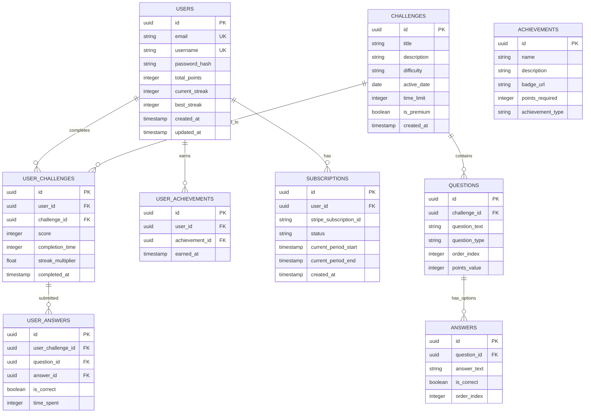

## 1. Architecture design


## 2. Technology Description
- Frontend: Next.js@14 + TypeScript + Tailwind CSS
- Backend: Node.js + Express@4 + TypeScript
- Database: Supabase PostgreSQL
- Caching: Redis@7
- Payments: Stripe SDK
- Authentication: Supabase Auth
- Initialization Tool: create-next-app

## 3. Route definitions
| Route | Purpose |
|-------|---------|
| / | Landing page with game overview and CTA |
| /auth/login | User authentication page |
| /auth/signup | User registration page |
| /auth/reset-password | Password reset functionality |
| /dashboard | User dashboard with daily challenges |
| /challenge/[id] | Individual challenge gameplay page |
| /leaderboard | Daily/weekly/all-time rankings |
| /profile | User profile and statistics |
| /profile/achievements | Achievement gallery |
| /admin | Admin dashboard |
| /admin/challenges | Challenge management |
| /admin/users | User management |
| /admin/analytics | Platform analytics |

## 4. API definitions

### 4.1 Authentication APIs
```
POST /api/auth/register
```
Request:
| Param Name | Param Type | isRequired | Description |
|------------|------------|-------------|-------------|
| email | string | true | User email address |
| password | string | true | User password (min 8 chars) |
| username | string | true | Unique username |

Response:
| Param Name | Param Type | Description |
|------------|-------------|-------------|
| user | object | User data with id, email, username |
| token | string | JWT authentication token |

```
POST /api/auth/login
```
Request:
| Param Name | Param Type | isRequired | Description |
|------------|------------|-------------|-------------|
| email | string | true | User email address |
| password | string | true | User password |

### 4.2 Challenge APIs
```
GET /api/challenges/daily
```
Response:
| Param Name | Param Type | Description |
|------------|-------------|-------------|
| challenge | object | Daily challenge with questions, timer, difficulty |
| userAttempt | object | User's previous attempt data (if any) |

```
POST /api/challenges/submit
```
Request:
| Param Name | Param Type | isRequired | Description |
|------------|------------|-------------|-------------|
| challengeId | string | true | Challenge identifier |
| answers | array | true | Array of answer objects |
| completionTime | number | true | Time taken in seconds |
| score | number | true | Calculated score |

### 4.3 Leaderboard APIs
```
GET /api/leaderboard?period=daily&limit=100
```
Query Parameters:
| Param Name | Param Type | Description |
|------------|-------------|-------------|
| period | string | daily, weekly, or all-time |
| limit | number | Number of results (max 100) |

### 4.4 User Profile APIs
```
GET /api/users/profile
```
Response:
| Param Name | Param Type | Description |
|------------|-------------|-------------|
| stats | object | Games played, average score, best streak |
| achievements | array | Unlocked achievement objects |
| subscription | object | Current subscription status |

### 4.5 Admin APIs
```
POST /api/admin/challenges
```
Request:
| Param Name | Param Type | isRequired | Description |
|------------|------------|-------------|-------------|
| title | string | true | Challenge title |
| questions | array | true | Array of question objects |
| difficulty | string | true | easy, medium, or hard |
| activeDate | string | true | ISO date for challenge activation |

## 5. Server architecture diagram


## 6. Data model

### 6.1 Data model definition


### 6.2 Data Definition Language

User Table (users)
```sql
-- create table
CREATE TABLE users (
    id UUID PRIMARY KEY DEFAULT gen_random_uuid(),
    email VARCHAR(255) UNIQUE NOT NULL,
    username VARCHAR(50) UNIQUE NOT NULL,
    password_hash VARCHAR(255) NOT NULL,
    total_points INTEGER DEFAULT 0,
    current_streak INTEGER DEFAULT 0,
    best_streak INTEGER DEFAULT 0,
    games_played INTEGER DEFAULT 0,
    average_score DECIMAL(5,2) DEFAULT 0,
    is_premium BOOLEAN DEFAULT FALSE,
    created_at TIMESTAMP WITH TIME ZONE DEFAULT NOW(),
    updated_at TIMESTAMP WITH TIME ZONE DEFAULT NOW()
);

-- create indexes
CREATE INDEX idx_users_email ON users(email);
CREATE INDEX idx_users_username ON users(username);
CREATE INDEX idx_users_points ON users(total_points DESC);

-- grant permissions
GRANT SELECT ON users TO anon;
GRANT ALL PRIVILEGES ON users TO authenticated;
```

Challenges Table (challenges)
```sql
-- create table
CREATE TABLE challenges (
    id UUID PRIMARY KEY DEFAULT gen_random_uuid(),
    title VARCHAR(255) NOT NULL,
    description TEXT,
    difficulty VARCHAR(20) CHECK (difficulty IN ('easy', 'medium', 'hard')),
    active_date DATE NOT NULL,
    time_limit INTEGER DEFAULT 300,
    is_premium BOOLEAN DEFAULT FALSE,
    is_active BOOLEAN DEFAULT TRUE,
    created_at TIMESTAMP WITH TIME ZONE DEFAULT NOW(),
    updated_at TIMESTAMP WITH TIME ZONE DEFAULT NOW()
);

-- create indexes
CREATE INDEX idx_challenges_active_date ON challenges(active_date);
CREATE INDEX idx_challenges_difficulty ON challenges(difficulty);

-- grant permissions
GRANT SELECT ON challenges TO anon;
GRANT ALL PRIVILEGES ON challenges TO authenticated;
```

Questions Table (questions)
```sql
-- create table
CREATE TABLE questions (
    id UUID PRIMARY KEY DEFAULT gen_random_uuid(),
    challenge_id UUID REFERENCES challenges(id) ON DELETE CASCADE,
    question_text TEXT NOT NULL,
    question_type VARCHAR(20) CHECK (question_type IN ('multiple_choice', 'word_puzzle')),
    order_index INTEGER NOT NULL,
    points_value INTEGER DEFAULT 10,
    created_at TIMESTAMP WITH TIME ZONE DEFAULT NOW()
);

-- create indexes
CREATE INDEX idx_questions_challenge_id ON questions(challenge_id);
CREATE INDEX idx_questions_order ON questions(challenge_id, order_index);

-- grant permissions
GRANT SELECT ON questions TO anon;
GRANT ALL PRIVILEGES ON questions TO authenticated;
```

Answers Table (answers)
```sql
-- create table
CREATE TABLE answers (
    id UUID PRIMARY KEY DEFAULT gen_random_uuid(),
    question_id UUID REFERENCES questions(id) ON DELETE CASCADE,
    answer_text VARCHAR(255) NOT NULL,
    is_correct BOOLEAN DEFAULT FALSE,
    order_index INTEGER NOT NULL
);

-- create indexes
CREATE INDEX idx_answers_question_id ON answers(question_id);
CREATE INDEX idx_answers_correct ON answers(question_id, is_correct);

-- grant permissions
GRANT SELECT ON answers TO anon;
GRANT ALL PRIVILEGES ON answers TO authenticated;
```

User Challenges Table (user_challenges)
```sql
-- create table
CREATE TABLE user_challenges (
    id UUID PRIMARY KEY DEFAULT gen_random_uuid(),
    user_id UUID REFERENCES users(id) ON DELETE CASCADE,
    challenge_id UUID REFERENCES challenges(id) ON DELETE CASCADE,
    score INTEGER NOT NULL DEFAULT 0,
    completion_time INTEGER,
    streak_multiplier DECIMAL(3,2) DEFAULT 1.0,
    correct_answers INTEGER DEFAULT 0,
    total_questions INTEGER DEFAULT 0,
    completed_at TIMESTAMP WITH TIME ZONE DEFAULT NOW(),
    UNIQUE(user_id, challenge_id)
);

-- create indexes
CREATE INDEX idx_user_challenges_user ON user_challenges(user_id);
CREATE INDEX idx_user_challenges_challenge ON user_challenges(challenge_id);
CREATE INDEX idx_user_challenges_completed ON user_challenges(completed_at DESC);
CREATE INDEX idx_user_challenges_score ON user_challenges(score DESC);

-- grant permissions
GRANT SELECT ON user_challenges TO anon;
GRANT ALL PRIVILEGES ON user_challenges TO authenticated;
```

Achievements Table (achievements)
```sql
-- create table
CREATE TABLE achievements (
    id UUID PRIMARY KEY DEFAULT gen_random_uuid(),
    name VARCHAR(100) NOT NULL,
    description TEXT,
    badge_url VARCHAR(255),
    points_required INTEGER DEFAULT 0,
    achievement_type VARCHAR(50) NOT NULL,
    rarity VARCHAR(20) CHECK (rarity IN ('common', 'rare', 'epic', 'legendary'))
);

-- create indexes
CREATE INDEX idx_achievements_type ON achievements(achievement_type);
CREATE INDEX idx_achievements_rarity ON achievements(rarity);

-- grant permissions
GRANT SELECT ON achievements TO anon;
GRANT ALL PRIVILEGES ON achievements TO authenticated;
```

User Achievements Table (user_achievements)
```sql
-- create table
CREATE TABLE user_achievements (
    id UUID PRIMARY KEY DEFAULT gen_random_uuid(),
    user_id UUID REFERENCES users(id) ON DELETE CASCADE,
    achievement_id UUID REFERENCES achievements(id) ON DELETE CASCADE,
    earned_at TIMESTAMP WITH TIME ZONE DEFAULT NOW(),
    UNIQUE(user_id, achievement_id)
);

-- create indexes
CREATE INDEX idx_user_achievements_user ON user_achievements(user_id);
CREATE INDEX idx_user_achievements_earned ON user_achievements(earned_at DESC);

-- grant permissions
GRANT SELECT ON user_achievements TO anon;
GRANT ALL PRIVILEGES ON user_achievements TO authenticated;
```

Subscriptions Table (subscriptions)
```sql
-- create table
CREATE TABLE subscriptions (
    id UUID PRIMARY KEY DEFAULT gen_random_uuid(),
    user_id UUID REFERENCES users(id) ON DELETE CASCADE,
    stripe_subscription_id VARCHAR(255) UNIQUE,
    status VARCHAR(50) NOT NULL,
    current_period_start TIMESTAMP WITH TIME ZONE,
    current_period_end TIMESTAMP WITH TIME ZONE,
    created_at TIMESTAMP WITH TIME ZONE DEFAULT NOW(),
    updated_at TIMESTAMP WITH TIME ZONE DEFAULT NOW()
);

-- create indexes
CREATE INDEX idx_subscriptions_user ON subscriptions(user_id);
CREATE INDEX idx_subscriptions_status ON subscriptions(status);
CREATE INDEX idx_subscriptions_period ON subscriptions(current_period_end);

-- grant permissions
GRANT SELECT ON subscriptions TO anon;
GRANT ALL PRIVILEGES ON subscriptions TO authenticated;
```